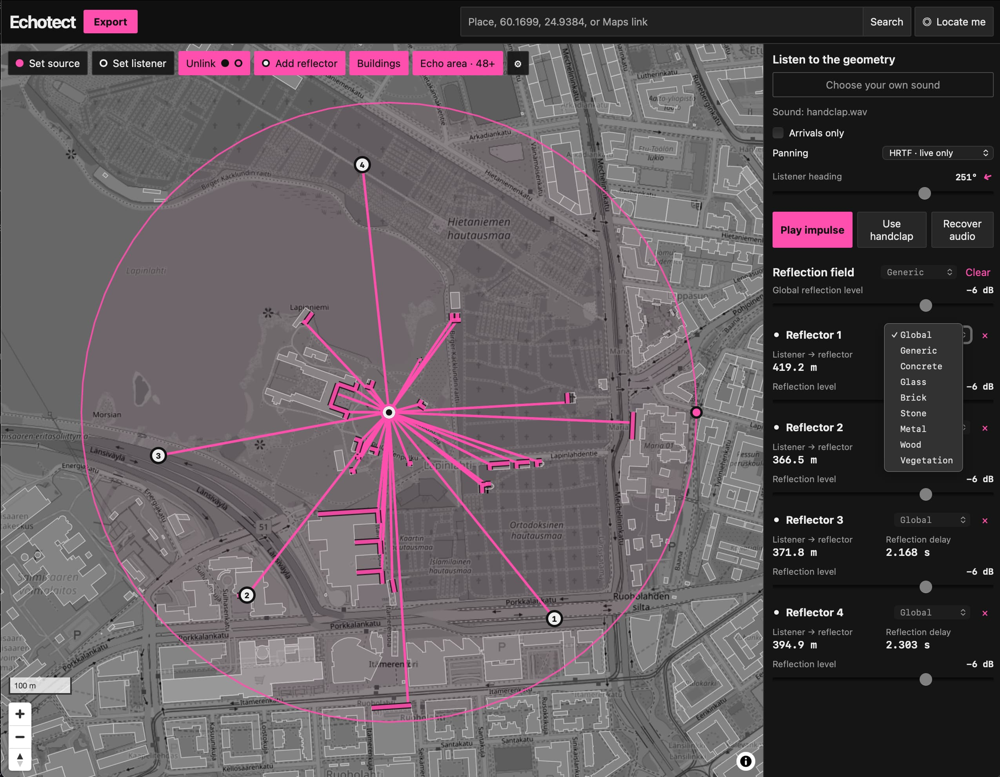

# Echotect: Turn your hood into a delay

Echotect turns real-world map geometry into musical delay structures. A Source,
Listener, and Reflectors define propagation paths that can be auditioned in the
browser, saved as an editable project, exported as audio, or opened in the
optional Max for Live device.

See it live: [**https://janne-s.github.io/Echotect/**](https://janne-s.github.io/Echotect/)

## How it works

Place a Source, Listener, and Reflectors on the map. Echotect uses the resulting
distances to time the direct sound and reflections. Longer paths arrive later
and lose more level and high-frequency energy. Reflector materials affect which
frequencies are absorbed, while the selected spatial mode controls how the
result is heard in the browser.

Point Reflectors create distinct echoes and can reflect sound between one
another. The Echo field uses nearby building surfaces to create a denser late
response. Projects remain editable, and audio can be exported as impulse
responses, a wet render, or aligned stems.

Use **Save** to store the editable project as a separate file and **Open** to
restore its map geometry, reflection field, materials, and listening settings.
Audio and Max for Live exports remain available through **Export**.

Use **Image** to replace the map with a PNG, JPEG, or WebP sketch. Calibrate its
scale from a known distance in the image, rotate it as needed, and place Source,
Listener, and Point Reflectors on top. The image is included in the saved project.

## Echo field settings

- **Point reflections** — Chooses between a longer, more diffuse point-reflection
  response and stricter geometric decay.
- **Point persistence** — Sets how strongly sound continues between Point
  Reflectors in Persistent mode.
- **Point bounces** — Limits how many times a point-reflection path can bounce.
- **Point path limit** — Limits the number of point-reflection paths used.
- **Atmosphere** — Uses standard air conditions, custom conditions, or disables
  air absorption.
- **Temperature** — Sets the air temperature for Custom atmosphere mode.
- **Relative humidity** — Sets the humidity for Custom atmosphere mode.
- **Air pressure** — Sets the air pressure for Custom atmosphere mode.
- **Air attenuation scale** — Adjusts the strength of air absorption; `1.00× ISO`
  is the normal model and `0.00×` disables its effect.
- **Geometric spreading** — Controls level loss over distance; `1/r` is the
  natural setting and Off removes this loss.
- **Material absorption scale** — Adjusts how strongly reflector materials color
  and absorb the sound; `1.00×` uses the normal material presets.
- **Late field** — Selects the sampled Convolution response or the Feedback
  network reverb.
- **Response duration** — Sets the maximum Convolution response length.
- **Echo field surfaces** — Limits how many nearby building surfaces are used.
- **Late path samples** — Sets how many sampled paths form the Convolution tail.
- **Late field bounces** — Limits the number of surface bounces in the late
  field.
- **Cutoff level** — Stops paths after they have become quieter than this level.
- **Tail persistence** — Controls how readily Convolution paths continue after
  each bounce.
- **Tail length** — Sets the Feedback network reverb time.
- **Density** — Controls how closely packed the Feedback network echoes are.
- **Damping** — Controls how quickly high frequencies fade from the Feedback
  network tail.
- **Geometry influence** — Controls how strongly the map geometry shapes the
  Feedback network.

## Max for Live

[Echotect Field](max-for-live/README.md) brings an Echotect project into Ableton
Live. Export a JSON project manifest from Echotect and import it into the device
to recreate its direct sound and reflection delays. The device provides
real-time controls for timing, direction, width, path count, and the balance
between the input and reflected sound.

The Max for Live device is functional, but still rudimentary and under
development.

## Data attribution

Map and building layers retain their required attribution in the application.
OpenStreetMap data is © OpenStreetMap contributors. Overture Maps building data
is licensed under ODbL.

## Support Echotect

If you find Echotect useful, you can support its continued development:

- **GitHub Sponsors** — support the open-source work, updates, and future
  improvements directly.
  [Become a GitHub Sponsor](https://github.com/sponsors/janne-s)
- **Ko-fi** — make a one-off contribution to support the project.
  [Support on Ko-fi](https://ko-fi.com/jannesarkela)

Thank you for supporting independent open-source audio tools.

See [**Sanara Creations**](https://www.sanaracreations.fi/) for my
multidisciplinary work, both independently and in collaboration with others.
