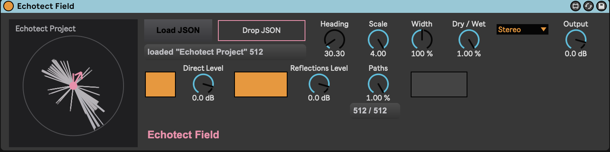

# Echotect Field for Max for Live

Echotect Field brings Echotect reflection patterns into Ableton Live as a
real-time spatial delay. Export a JSON project manifest from Echotect, load it
into the device, and the direct sound and reflection paths are recreated from
the geometry calculated by Echotect.

The imported pattern can then be shaped while Live is running. You can change
its timing, rotate and widen the spatial field, choose how many reflection paths
are active, and mix the result with the input signal.

The device is functional, but still rudimentary and under development.



## Using the device

1. Create a Source, Listener, and Reflectors in Echotect.
2. Export the project manifest as a JSON file.
3. Load Echotect Field on a track in Ableton Live.
4. Import the exported JSON file into the device.

The main controls are:

- **Paths** — Chooses how many of the imported reflection paths are active.
- **Scale** — Expands or contracts the timing of the imported pattern.
- **Heading** — Rotates the listening direction.
- **Width** — Narrows or widens the spatial spread.
- **Direct** — Adjusts the propagated direct sound.
- **Reflections** — Adjusts the reflected sound.
- **Dry/Wet** — Balances the input and processed sound.

## Contents

- `Echotect Field.maxpat` — canonical, hand-edited device and UI
- `Echotect Field.maxproj` — Max development project
- `echotect_voice.maxpat` — delay-tap voice
- `echotect_controller.js` — import and device controller
- `echotect_model.js` — deterministic manifest and spatial model
- `echotect_field.js` — field visualization
- `test/model.test.js` — deterministic model tests

The canonical `Echotect Field.maxpat` is maintained by hand. Build scripts and
generated templates must not overwrite it or replace its Presentation layout.
Inspect the current patch and preserve unrelated UI edits before every change.

## Development and packaging

Add this directory to **Max → Settings → File Preferences** with subfolder
search enabled. Open `Echotect Field.maxproj`, then open the canonical patch.
When copying the patch into a Max Audio Effect editor, confirm that Max Console
shows:

```text
Echotect controller loaded
Echotect field UI loaded
```

Choose **Freeze Device** before saving the distributable AMXD so that its
required components are included with the device.
